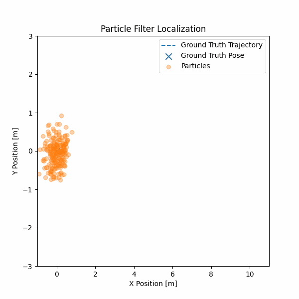
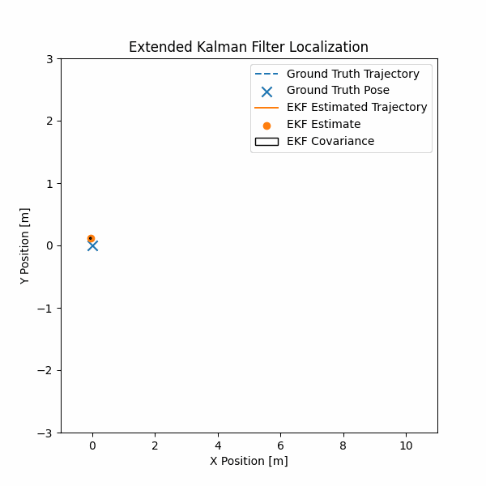

# ekf_pf_localization_in_ros2

# Localization with EKF & Particle Filter (ROS 2)

This (Work-in-Progress)project demonstrates **probabilistic localization for mobile robots** using two classical state-estimation techniques:

- **Extended Kalman Filter (EKF)**
- **Particle Filter (Monte Carlo Localization)**

The goal of this project is to provide a **clear, visual, and reproducible comparison** of EKF and Particle Filter approaches for 2D robot navigation, implemented in **ROS 2** with strong, easy to understand visualization support using simulated odometery readings.

---

## Features

- ROS 2 native C++ implementation
- Ground truth vs estimated pose comparison
- Particle cloud visualization

---

## Problem Setup

**Robot State**

x = [x, y, θ]

**Inputs**
- Control / odometry input
- Simulated sensor measurements

**Outputs**
- Estimated robot pose
- Trajectory history
- Estimation uncertainty

---

## Quick overview of algorithms

## Extended Kalman Filter (EKF)
- Nonlinear motion and measurement models
- First-order linearization
- Gaussian belief representation
- Explicit covariance propagation

## Particle Filter (PF)
- Non-parametric belief representation
- Importance sampling and resampling
- Robust to non-Gaussian noise
- Multi-modal hypothesis tracking

---

## Visualizations

## Particle Filter — Particle Cloud Evolution
The particle filter maintains a distribution of pose hypotheses.  
Each frame shows the particle cloud converging around the ground-truth robot pose.

---

### Extended Kalman Filter — Mean & Covariance
The EKF represents belief as a Gaussian.  
Each frame shows the estimated pose, covariance ellipse, and trajectory history.

---

## Evaluation

The project supports both **qualitative and quantitative** evaluation:

- Trajectory comparison (ground truth vs EKF vs PF)
- TODO: Root Mean Square Error (RMSE) over time
- TODO: Visual convergence behavior
- TODO: Noise sensitivity analysis

---

